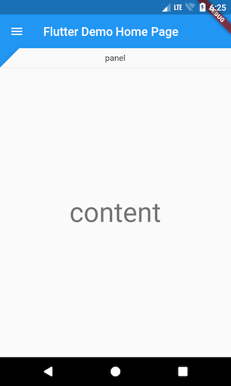
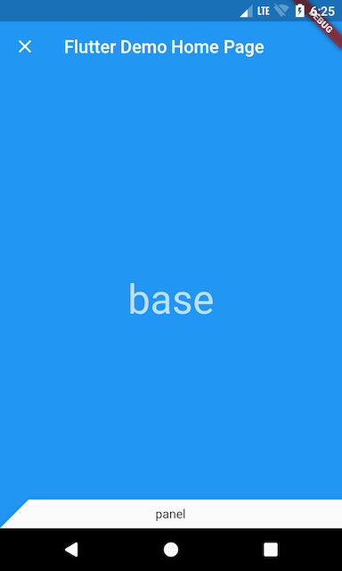

# Flutter Backdrop Demo

It is a simple [backdrop](https://material.io/design/components/backdrop.html) implementation with flutter. I referred to [flutter gallery](https://github.com/flutter/flutter/tree/master/examples/flutter_gallery).

## Screenshots

| Open | Close |
|:---:|:---:|
|  |  |
